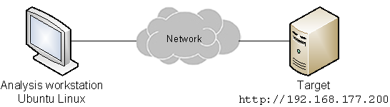

# Network Traffic Analysis Lab

This repository contains materials and exercises for analyzing network traffic using Wireshark and nmap. The exercises are based on a lab environment provided by Cyrin Labs and focus on TCP/IP fundamentals, protocol behavior, and attack methodologies. The repository is structured to aid in learning the basics of network protocol analysis and performing basic network scans.

## Project Architecture Diagram

Below is the **logical architecture diagram** for the project, showcasing how customer data flows through the system and is processed by the database and Splunk for analysis.

## Objectives
- **Explore TCP Sessions**: Analyze TCP sessions, including the 3-way handshake.
- **Investigate Attack Behavior**: Use Wireshark to observe ARP requests, ICMP traffic, and HTTP interactions.
- **Perform Network Scans**: Utilize `nmap` to identify the attack surface of a target system.
- **Observe Attack Patterns**: Use packet capture analysis to recognize attacker behaviors.

## Prerequisites
- Familiarity with TCP/IP networking basics.
- Basic command-line experience (no advanced expertise required).
- Access to an Ubuntu 18.04 Linux environment with Wireshark and nmap installed.

## Exercise Environment
The exercises were performed in a controlled lab network provided by **Cyrin Labs**. This includes pre-recorded packet capture files and a dedicated Ubuntu system for scanning a target web server.

## Lab Structure
1. **Packet Capture Analysis**:
   - Analyze TCP Handshakes.
   - Observe ARP requests and ICMP pings.
   - Analyze HTTP traffic.
2. **Network Scanning**:
   - Perform basic network scans using `nmap`.
   - Enumerate the attack surface using reconnaissance techniques.

## Files and Directories
- `pcaps/`: Contains pre-recorded packet captures for analysis.
- `nmap_scans/`: Includes outputs and summaries from `nmap` scans.
- `analysis_scripts/`: Scripts to assist in traffic and protocol analysis.
- `screenshots/`: Visuals to aid in understanding observed behaviors.
- `notes/`: Detailed notes on methodologies and observations.
